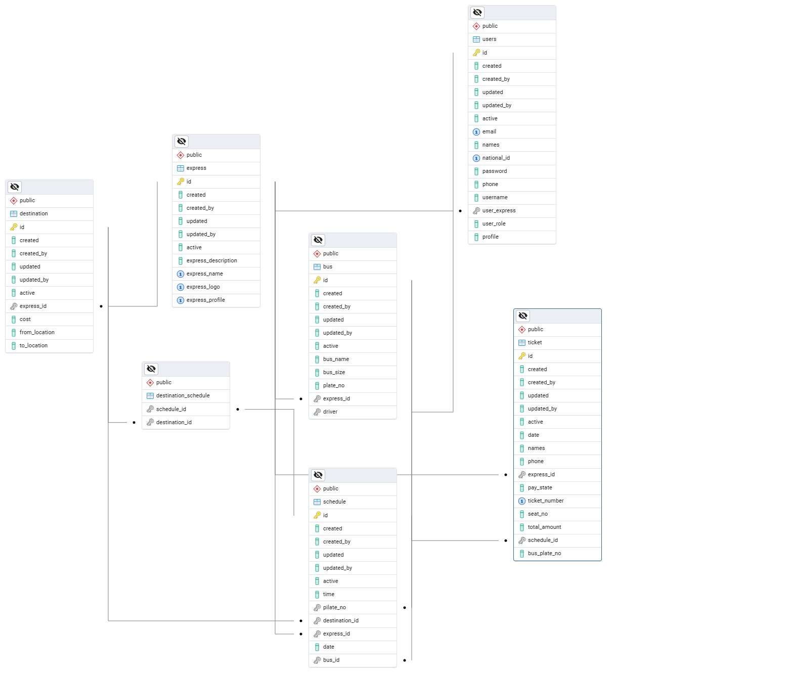

# TegaBus Web Application

**Student Name:** Duhimbazimana Johnson  
**Student ID:** 25969

---

## Introduction

The TegaBus web application addresses inefficiencies in the current bus ticketing system, where users cannot easily purchase tickets online for specific express, and agents face challenges managing bookings manually. This project provides a centralized platform where users can browse express, select destinations, view schedules, and purchase tickets seamlessly. Agents can book and issue tickets for clients based on available schedules, while administrators manage routes, destinations, and buses. Developed for the Web Technology course, TegaBus leverages React for the front-end, Spring Boot for the back-end, and PostgreSQL for data storage, using a layered architecture. The application incorporates secure authentication, responsive design, and version control with Git, with plans to explore hybrid app development in the future using frameworks like React Native or Flutter. This documentation outlines the problem, requirements, domain model, implementation details, and deployment strategy, fulfilling all course project requirements.

---

## 1. Problem Description and Requirements

### Problem Description

The current bus ticketing process is inefficient, requiring users to visit physical ticket counters or rely on uncoordinated communication with agents. Key issues include:

- **Inaccessibility:** Users cannot buy tickets online for specific bus express, limiting convenience.  
- **Inefficient Booking:** Agents manually manage bookings, leading to errors and delays.  
- **Lack of Transparency:** Users lack real-time access to schedules, routes, and ticket availability.  
- **Poor User Experience:** No centralized platform exists for seamless ticket purchasing and management.  

TegaBus addresses these issues by providing a platform where users can browse express, select and purchase tickets online, and agents can manage bookings and issue tickets based on available schedules.

### Key Business Requirements

- **User Ticket Purchase:** Users can browse express, select a destination, view schedules, and purchase tickets online.  
- **Driver:** Driver can browse assigned schedules.  
- **Agent Management:** Agents can view schedules, book tickets for clients, and issue tickets.  
- **Schedule Management:** Display available bus schedules with details like departure time, route, and available seats.  
- **Responsive Design:** Accessible on desktops, tablets, and mobile devices.  
- **Secure Authentication:** Support OAuth2-based login and role-based access (Driver, Agent, Admin, Super Admin).  
- **Performance Optimization:** Ensure fast load times and efficient data retrieval.  
- **Data Persistence:** Store user, express, destination, schedule, ticket, and bus data in a PostgreSQL database.

### Quality Attributes

- **Usability:** Intuitive interface for users and agents.  
- **Scalability:** Handle multiple concurrent users and bookings.  
- **Security:** Protect user data and transactions with secure authentication and authorization.  
- **Reliability:** Ensure accurate booking and schedule information.  

---

## 2. Domain & Data Modeling

### a. ER Diagram

The ER diagram defines the core entities, their attributes, and relationships.




### b. Domain Concepts

#### Actors

- **User:** Browses express, selects destinations, views schedules, and purchases tickets.  
- **Driver:** Browses schedule assigned to him/her  
- **Agent:** Manages bookings, issues tickets, and views schedules.  
- **Admin:** Manages express, destinations, buses, and schedules.

#### Processes

- **Ticket Purchase:** User selects an express, destination, and schedule, then purchases a ticket.  
- **Ticket Issuance:** Agent books or issues tickets for clients based on available schedules.  
- **Schedule Management:** Admin adds or updates schedules, ensuring accurate availability.

#### Data Objects

- **User:** Stores user credentials and role.  
- **Agent:** Stores agent contact details.  
- **Express:** Represents bus express (e.g., Kigali to Huye).  
- **Destination:** Represents locations with details like city and distance.  
- **Schedule:** Links express, destinations, and buses with departure times and seat availability.  
- **Ticket:** Records booking details, including user, agent, and schedule.  
- **Bus:** Stores bus details like Pilate number and capacity.

### c. Technology-Oriented Schema

The database schema is designed for **PostgreSQL**, with primary keys, foreign keys, and constraints.

```sql
-- Destination Table
CREATE TABLE public.destination (
    id UUID PRIMARY KEY,
    created TIMESTAMP WITHOUT TIME ZONE,
    created_by VARCHAR(255),
    updated TIMESTAMP WITHOUT TIME ZONE,
    updated_by VARCHAR(255),
    active BOOLEAN,
    express_id UUID REFERENCES public.express(id),
    cost DOUBLE PRECISION,
    from_location SMALLINT,
    to_location SMALLINT
);

-- Express Table
CREATE TABLE public.express (
    id UUID PRIMARY KEY,
    created TIMESTAMP WITHOUT TIME ZONE,
    created_by VARCHAR(255),
    updated TIMESTAMP WITHOUT TIME ZONE,
    updated_by VARCHAR(255),
    active BOOLEAN,
    express_description VARCHAR(255),
    express_name VARCHAR(255),
    express_logo VARCHAR(255),
    express_profile VARCHAR(255)
);

-- Bus Table
CREATE TABLE public.bus (
    id UUID PRIMARY KEY,
    created TIMESTAMP WITHOUT TIME ZONE,
    created_by VARCHAR(255),
    updated TIMESTAMP WITHOUT TIME ZONE,
    updated_by VARCHAR(255),
    active BOOLEAN,
    bus_name VARCHAR(255),
    bus_size INTEGER,
    plate_no VARCHAR(255),
    express_id UUID REFERENCES public.express(id),
    driver UUID
);

-- Users Table
CREATE TABLE public.users (
    id UUID PRIMARY KEY,
    created TIMESTAMP WITHOUT TIME ZONE,
    created_by VARCHAR(255),
    updated TIMESTAMP WITHOUT TIME ZONE,
    updated_by VARCHAR(255),
    active BOOLEAN,
    email VARCHAR(255),
    names VARCHAR(255),
    national_id VARCHAR(255),
    password VARCHAR(255),
    phone VARCHAR(255),
    username VARCHAR(255),
    user_express UUID REFERENCES public.express(id),
    user_role VARCHAR(255),
    profile VARCHAR(255)
);

-- Schedule Table
CREATE TABLE public.schedule (
    id UUID PRIMARY KEY,
    created TIMESTAMP WITHOUT TIME ZONE,
    created_by VARCHAR(255),
    updated TIMESTAMP WITHOUT TIME ZONE,
    updated_by VARCHAR(255),
    active BOOLEAN,
    time VARCHAR(255),
    plate_no UUID,
    destination_id UUID REFERENCES public.destination(id),
    express_id UUID REFERENCES public.express(id),
    date VARCHAR(255),
    bus_id UUID REFERENCES public.bus(id)
);

-- Ticket Table
CREATE TABLE public.ticket (
    id UUID PRIMARY KEY,
    created TIMESTAMP WITHOUT TIME ZONE,
    created_by VARCHAR(255),
    updated TIMESTAMP WITHOUT TIME ZONE,
    updated_by VARCHAR(255),
    active BOOLEAN,
    date TIMESTAMP WITHOUT TIME ZONE,
    names VARCHAR(255),
    phone VARCHAR(255),
    express_id UUID REFERENCES public.express(id),
    pay_state VARCHAR(255),
    ticket_number INTEGER,
    seat_no INTEGER,
    total_amount DOUBLE PRECISION,
    schedule_id UUID REFERENCES public.schedule(id),
    bus_plate_no VARCHAR(255)
);

-- Destination_Schedule Join Table
CREATE TABLE public.destination_schedule (
    schedule_id UUID REFERENCES public.schedule(id),
    destination_id UUID REFERENCES public.destination(id),
    PRIMARY KEY(schedule_id, destination_id)
);

```
---

## 3. Front-End Design

The front-end is built using React with Tailwind CSS and React with Vite for responsive design, ensuring adaptability across devices. The layout uses a responsive grid that adjusts to one column on mobile devices and two columns on larger screens.

---

## 4. Back-End Implementation

The back-end uses Spring Boot with a layered architecture (Controller, Service, Repository) to handle business logic and communicate with the front-end via REST APIs. Sample code for the ticket controller and service is available in the repository.

---

## 5. Database

The application uses PostgreSQL for data storage, as defined in the schema above. The database ensures data integrity with constraints and indexes for performance.

---

## 6. Secure Authentication

Authentication is implemented using Spring Security with OAuth2 and JWT for session management.

---

## 7. Authorization Model

**Roles:** Driver, Agent, Admin, Super Admin  

**Access Control:**  

- **Driver:** Can view schedules assigned to him/her  
- **Agents:** Can book and issue tickets for clients  
- **Admins:** Can manage express, destinations, buses, and schedules  
- **Super Admin:** Can control everything and support  

Implemented using Spring Security’s role-based authorization.

---

## 8. Future Exploration

The current TegaBus application is web-based, but there are plans to explore hybrid app development in the future using frameworks like Flutter. This will enable TegaBus to run on iOS and Android, reusing much of the existing React front-end code.
